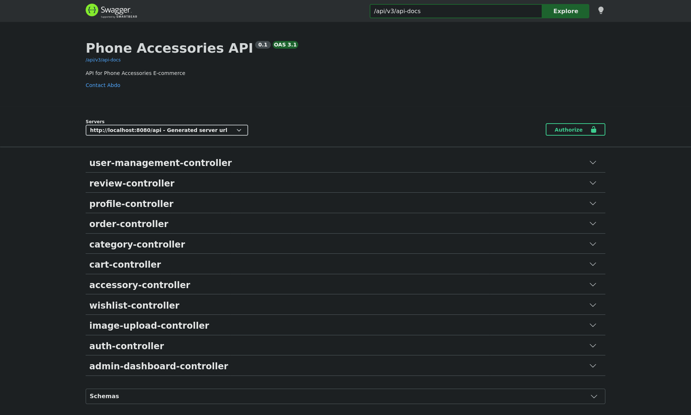
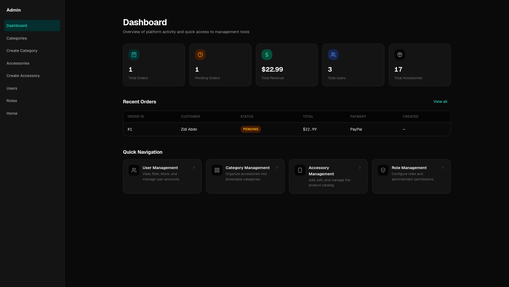
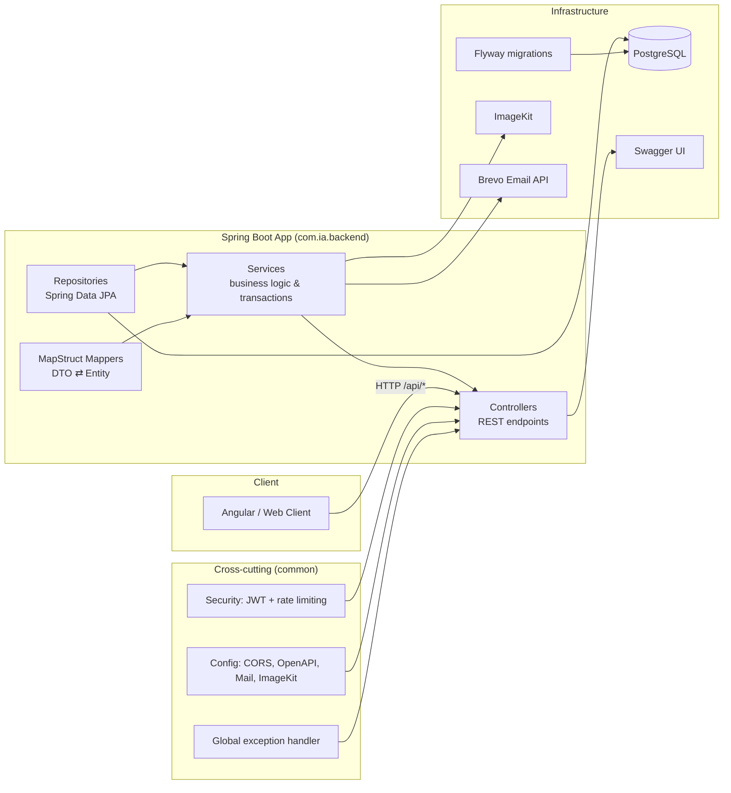

# Phone Accessories Backend


A production-grade REST API powering a **phone accessories e-commerce** platform. It provides a complete online store backend — product catalog, shopping cart, wishlist, orders, reviews, and user authentication — together with an admin area for managing catalog, users, and store analytics.

> **Note:** This repository contains the backend project only.
> The frontend is available at [phone-accessories-frontend](https://github.com/zidi-abderrahmen/phone-accessories-frontend).

---

<p align="center">
  <a href="https://phone-accessories-frontend.zd-abderrahmen.workers.dev">🔗 Live Demo</a>
</p>

---

## Table of Contents

- [Overview](#overview)
- [Features](#features)
- [Screenshots](#screenshots)
- [Tech Stack](#tech-stack)
- [Architecture Overview](#architecture-overview)
- [Project Structure](#project-structure)
- [API Reference](#api-reference)
- [Installation](#installation)
- [Environment Setup](#environment-setup)
- [Running Locally](#running-locally)
- [Production Deployment](#production-deployment)
- [Continuous Integration & Docker Publishing](#continuous-integration--docker-publishing)
- [Security](#security)
- [Testing](#testing)
- [Roadmap](#roadmap)
- [Contributing](#contributing)
- [License](#license)
- [Author](#author)

## Overview

The **Phone Accessories Backend** is a stateless REST API built with Spring Boot. It implements the full store lifecycle: users register and verify their email, browse a searchable catalog of accessories, manage a cart and wishlist, place orders, and review products. Store administrators manage the catalog, moderate users, upload product images, and monitor store performance through a dashboard.

The service is container-ready, ships with a Flyway-managed database schema, and is secured with cookie-based JWT authentication plus per-IP rate limiting on sensitive endpoints.

## Features

### Catalog
- CRUD for **categories** and **accessories** (title, description, price, stock, unique product code, image)
- **Search & filter** accessories by category, keyword, price range, and stock availability
- Paginated listings throughout the catalog — default page size `20`, capped at `100`, with per-request validation of `page`/`size`

### Shopping experience
- Persistent user **cart** — add, update quantity, remove items, clear cart
- **Wishlist** — save accessories for later, per-user and unique per accessory
- **Reviews** — rate accessories (1–5) with comments; owners can edit or delete their reviews
- **Orders** — checkout from cart with shipping details, payment method, and shipping method; total auto-computed with shipping fee (Standard `$7` / Express `$15`); stock is validated and decremented atomically
- Order **cancellation** (only while `PENDING`) and **deletion** (only when `CANCELLED`) — cancellation restores stock automatically; deletion just removes the already-cancelled order (no further stock changes)
- Real-time stock safety with **optimistic locking** (`@Version`) and a database-level `CHECK (stock >= 0)`
- **Mock payment flow** — `CREDIT_CARD` and `PAYPAL` orders run through a `MockPaymentGateway` that records `paymentStatus` (`PENDING` / `PAID` / `FAILED` / `REFUNDED`), a gateway reference, and `paidAt`; cash-on-delivery stays `PENDING`. Cancelling a paid order marks it `REFUNDED`, and the storefront labels the step as a demo.

### Accounts & security
- Registration with **email verification** (verification links sent via the Brevo email API, asynchronously)
- Login, **refresh-token rotation**, and logout backed by hashed, revocable per-user refresh tokens
- "Remember me" sessions with extended lifetimes
- **Password reset** flow (forgot → emailed token → reset)
- Profile management: view, update, change password

### Administration
- Admin **dashboard** with KPIs: total orders, pending orders, total revenue, user count, accessory count, and most recent orders
- User management: list, **block/unblock**, **soft-delete/restore**
- Role management (`SUPER_ADMIN`, `ADMIN`, `USER`), promoting admins, role CRUD
- Product image upload to **ImageKit** with strict validation (JPEG/PNG/WEBP, ≤ 5 MB, ≤ 25 megapixels)

### Platform
- **Rate limiting** (Bucket4j) — 5 requests/minute per client IP on all authentication endpoints
- Swagger/OpenAPI docs (enabled in non-production profiles)
- Actuator health, info, and metrics endpoints
- Optimized for containerized deployment (multi-stage Docker build)

## Screenshots

| OpenAPI (Swagger UI)                                    | Admin dashboard                                                   |
|---------------------------------------------------------|-------------------------------------------------------------------|
|  |  |

## Tech Stack

| Layer | Technology |
|---|---|
| Language | Java 21 |
| Framework | Spring Boot 4.1.0 |
| Build tool | Maven (wrapper included) |
| Database | PostgreSQL + Spring Data JPA (Hibernate) |
| Migrations | Flyway |
| Security | Spring Security, JWT (jjwt 0.13.0); OAuth2 (Google client config stub in dev profile — not wired up) |
| Validation | Spring Boot Starter Validation (Bean Validation) |
| API docs | SpringDoc OpenAPI (Swagger UI) 3.0.3 |
| Object mapping | MapStruct 1.6.3 |
| Boilerplate | Lombok |
| Rate limiting | Bucket4j 8.19.0 |
| Image hosting | ImageKit SDK 3.0.0 |
| Email | Brevo (via API key) |
| Observability | Spring Boot Actuator |
| Container | Docker (multi-stage, `eclipse-temurin:21`) |

## Architecture Overview

A **layered monolith** organized **package-by-feature** under the root package `com.ia.backend`. Each feature area is a self-contained module following the same internal slicing (`controller → service → repository → entity`, with `dto` and `mapper`):



Cross-cutting concerns (security filters, configuration, exceptions, utilities) live in a shared `common` package, while `bootstrap` seeds the initial **super-admin** account at startup.

## Project Structure

```
src/main/java/com/ia/backend/
├── BackendApplication.java        # Application entry point
├── bootstrap/                     # Super-admin seeder
├── accessory/                     # Product catalog (controller / service / repository / entity / dto / mapper)
├── admin/                         # Admin dashboard KPIs
├── cart/                          # Shopping cart (full layered module)
├── category/                      # Product categories (full layered module)
├── common/                        # Cross-cutting infrastructure
│   ├── config/                    # Security, CORS, OpenAPI, ImageKit, Brevo, async, password encoder
│   ├── enums/                     # OrderStatus
│   ├── exception/                 # Custom exceptions + GlobalExceptionHandler
│   ├── security/                  # JwtAuthenticationFilter, RateLimitingFilter, UserPrincipal
│   └── util/                      # JwtUtils
├── image/                         # ImageKit upload controller/service + validator
├── order/                         # Orders (entity, enums, full layered module)
├── review/                        # Product reviews (full layered module)
├── user/                          # Auth, profiles, user/role management, verification, password reset
└── wishlist/                      # Wishlist (full layered module)

src/main/resources/
├── application.yaml               # Common configuration
├── application-dev.yaml           # Local dev profile (gitignored; template: application-dev.yaml.example)
├── application-prod.yaml          # Production profile (env-var driven)
└── db/migration/                  # Flyway SQL migrations (V1–V8)
```

## API Reference

All endpoints are served under the **`/api`** context path.

### Authentication & Profiles

| Method | Endpoint | Access | Description |
|---|---|---|---|
| `POST` | `/api/auth/register` | Public | Register a user (email verification required) |
| `POST` | `/api/auth/login` | Public | Login; sets JWT cookies (`access_token`, `refresh_token`) |
| `POST` | `/api/auth/refresh-token` | Public | Rotate refresh token from cookie |
| `POST` | `/api/auth/verify-email` | Public | Verify email with emailed token |
| `POST` | `/api/auth/forgot-password` | Public | Request password-reset email |
| `POST` | `/api/auth/reset-password` | Public | Reset password with token |
| `POST` | `/api/auth/logout` | Authenticated | Clear auth cookies |
| `GET` | `/api/profile/me` | Authenticated | Current user profile |
| `PUT` | `/api/profile/update` | Authenticated | Update profile |
| `PUT` | `/api/profile/change-password` | Authenticated | Change password |

### Catalog & Reviews

| Method | Endpoint | Access | Description |
|---|---|---|---|
| `GET` | `/api/categories` | Public | List categories (paginated) |
| `GET` | `/api/categories/{id}` | Public | Get a category |
| `GET` | `/api/categories/{id}/accessories` | Public | Accessories for a category |
| `POST` / `PUT` / `DELETE` | `/api/categories...` | Admin / Super (DELETE Super only) | Category management |
| `GET` | `/api/accessories` | Public | List accessories (paginated) |
| `GET` | `/api/accessories/{id}` | Public | Get an accessory |
| `GET` | `/api/accessories/search` | Public | Filter by `categoryId`, `keyword`, `minPrice`, `maxPrice`, `inStock` |
| `POST` / `PUT` / `DELETE` | `/api/accessories...` | Admin / Super (DELETE Super only) | Accessory management |
| `GET` | `/api/reviews/accessory/{id}` | Public | Reviews for an accessory |
| `POST` | `/api/reviews/accessory/{id}` | Authenticated | Add a review (rating 1–5) |
| `PUT` / `DELETE` | `/api/reviews/{id}` | Authenticated (owner) | Update / delete own review |

### Cart, Wishlist & Orders

| Method | Endpoint | Access | Description |
|---|---|---|---|
| `GET` | `/api/carts/my-cart` | Authenticated | Get my cart |
| `POST` | `/api/carts/my-cart` | Authenticated | Add item (`accessoryId`, `quantity`) |
| `PUT` | `/api/carts/my-cart/cart-item/{id}` | Authenticated | Update quantity |
| `DELETE` | `/api/carts/my-cart/cart-item/{id}` | Authenticated | Remove cart item |
| `DELETE` | `/api/carts/my-cart` | Authenticated | Clear cart |
| `GET` | `/api/wishlist` | Authenticated | Get wishlist |
| `POST` | `/api/wishlist/items/{accessoryId}` | Authenticated | Add to wishlist |
| `DELETE` | `/api/wishlist/items/{accessoryId}` / `/api/wishlist/items` | Authenticated | Remove item / clear wishlist |
| `GET` | `/api/orders` | Authenticated | My order history |
| `GET` | `/api/orders/{id}` | Authenticated | Order detail |
| `POST` | `/api/orders` | Authenticated | Place order from cart |
| `PUT` | `/api/orders/{id}/cancel` | Authenticated | Cancel (only `PENDING`) |
| `PATCH` | `/api/orders/{id}/status` | Admin / Super | Advance order status (`PENDING → PROCESSING → SHIPPED → DELIVERED`) |
| `DELETE` | `/api/orders/{id}` | Authenticated | Delete (only `CANCELLED`) |

### Admin & Uploads

| Method | Endpoint | Access | Description |
|---|---|---|---|
| `GET` | `/api/admin/dashboard/order-limit/{limit}` | Admin / Super | Dashboard KPIs + last N orders |
| `GET` | `/api/users` | Admin / Super | List users |
| `POST` | `/api/users/admins` | Super admin | Promote a user to admin |
| `PUT` | `/api/users/{id}/blocked/{blocked}` | Admin / Super | Block / unblock user |
| `PATCH` | `/api/users/{id}/deleted/{deleted}` | Admin / Super | Soft-delete / restore user |
| `GET/POST/PUT/DELETE` | `/api/users/roles...` | Admin / Super | Role management (create/update super-admin only) |
| `POST` | `/api/images` | Admin / Super | Upload product image (multipart, ≤ 5 MB) |

### Enums

| Enum | Values |
|---|---|
| `PaymentMethod` | `CASH_ON_DELIVERY`, `CREDIT_CARD`, `PAYPAL` |
| `ShippingMethod` | `STANDARD`, `EXPRESS` |
| `OrderStatus` | `PENDING`, `PROCESSING`, `SHIPPED`, `DELIVERED`, `CANCELLED` |

Interactive documentation is available through **Swagger UI** in non-production profiles:
`/api/swagger-ui.html` (or `/swagger-ui/index.html`).

## Installation

### Prerequisites
- **JDK 21**
- **Maven 3.9+** (optional — the Maven wrapper `./mvnw` is included)
- **PostgreSQL** (local instance for development)
- **Docker** (only required for containerized runs)

### 1. Clone & prepare configuration

```bash
git clone https://github.com/zidi-abderrahmen/phone-accessories-backend.git
cd backend

# Create your local environment files from the committed templates
cp src/main/resources/application-dev.yaml.example src/main/resources/application-dev.yaml
cp .env.docker.example .env.docker
```

Then fill in the values in both files (database credentials, JWT secret, mail API key, ImageKit private key, etc.).

### 2. Create the database

```sql
CREATE DATABASE phone_accessories;
```

Flyway will apply the schema (`V1`–`V8`) automatically on startup.

### 3. Build

```bash
./mvnw clean package
```

## Environment Setup

Configuration is profile-based (**`dev`** is the default profile).

| Variable | Required | Description |
|---|---|---|
| `PROFILE` | No | Active profile — `dev` (default) or `prod` |
| `PORT` | No | Server port (default `8080`) |
| `SPRING_DATASOURCE_URL` | Yes | PostgreSQL JDBC URL |
| `SPRING_DATASOURCE_USERNAME` / `SPRING_DATASOURCE_PASSWORD` | Yes | Database credentials |
| `APPLICATION_SECURITY_JWT_SECRET` | Yes | Base64-encoded 256-bit HS256 secret |
| `APPLICATION_SECURITY_JWT_EXPIRATION` | Yes | Access-token lifetime (ms) |
| `APPLICATION_SECURITY_JWT_REFRESH_EXPIRATION` | Yes | Refresh-token lifetime (ms) |
| `APPLICATION_SECURITY_JWT_REMEMBER_ME_EXPIRATION` | Yes | "Remember me" lifetime (ms) |
| `APPLICATION_SECURITY_COOKIES_SECURE` | No | Cookie `Secure` flag (`false` in dev) |
| `APPLICATION_SUPER_ADMIN_*` | Yes | Bootstrapped super-admin credentials |
| `APPLICATION_FRONTEND_URL` | Yes | Allowed frontend origin |
| `APPLICATION_TOKEN_PEPPER` | Yes | 64-character hex key signing refresh tokens |
| `APP_MAIL_API_KEY` | Yes | Brevo email API key |
| `APP_MAIL_FROM` / `APP_MAIL_FROM_NAME` | Yes | Email sender |
| `APPLICATION_OPENAPI_*` | No | Swagger metadata |
| `IMAGEKIT_PRIVATE_KEY` | Yes | ImageKit private key |
| `CORS_ALLOWED_ORIGINS` | Yes | Comma-separated allowed origins |

> **Note on naming conventions.** Local dev, the `.env.docker` example, and the CI workflow use the long `SPRING_*` / `APPLICATION_*` / `APP_MAIL_*` names above. The production profile (`application-prod.yaml`) reads shorter names instead: `DATABASE_URL`, `DATABASE_USERNAME`, `DATABASE_PASSWORD`, `JWT_SECRET`, `JWT_EXPIRATION_MS`, `JWT_REFRESH_EXPIRATION_MS`, `JWT_REMEMBER_ME_EXPIRATION_MS`, `COOKIES_SECURE`, `COOKIES_SAME_SITE`, `SUPER_ADMIN_*`, `FRONTEND_URL`, `TOKEN_PEPPER`, `MAIL_API_KEY`, `MAIL_FROM`, `MAIL_FROM_NAME`, `OPENAPI_*`, `CORS_ALLOWED_ORIGINS`, `IMAGEKIT_PRIVATE_KEY`.

> The committed `application-dev.yaml` is **gitignored** and may contain real local credentials. Never commit secrets. Export everything as environment variables in production (per `application-prod.yaml`).

## Running Locally

```bash
# With the Maven wrapper (defaults to the dev profile and port 8080)
./mvnw spring-boot:run

# Or run the built artifact
java -jar target/backend-0.0.1-SNAPSHOT.jar
```

- Base URL: `http://localhost:8080/api`
- Swagger UI: `http://localhost:8080/api/swagger-ui.html`
- Health check: `http://localhost:8080/api/actuator/health`

On first startup, the application creates the schema via Flyway and seeds a **super-admin** account from your environment configuration.

## Production Deployment

### Hosting topology

| Component | Platform | Notes |
|---|---|---|
| Backend API | **Render** web service (Docker) | Built from the repo's multi-stage `Dockerfile`; listens on Render's `PORT` |
| Frontend | **Cloudflare Workers** | Static SPA + `/api/*` reverse proxy (`wrangler.jsonc`, `src/worker.ts`) |
| Database | **Neon** (serverless PostgreSQL 16) | **Not** a Render Postgres add-on — see [Database & backups](#database--backups-neon) |
| Object storage | ImageKit | Product images |
| Transactional email | Brevo API | Verification / password-reset mail |

The tiers are independent. The Cloudflare Worker proxies `/api/*` to the Render backend (`API_URL` in `wrangler.jsonc`), and the backend connects out to Neon over TLS.

### Deploy flow

1. Push to `main`.
2. GitHub Actions (`.github/workflows/ci.yml`) runs `./mvnw clean verify` against an ephemeral `postgres:16` service and, on a `main` push, builds and publishes the Docker image to GHCR (`publish-image` job).
3. Render deploys the web service from the repository (Docker build) via the committed `render.yaml` blueprint — auto-deploy on `main`, or a manual deploy. Render injects `PORT`; no port needs to be hard-coded.
4. On boot, **Flyway applies any pending `V*` migrations to Neon before the app serves traffic**. A failed migration aborts startup rather than leaving the schema half-applied.
5. Render's health check hits `GET /api/actuator/health` (returns `200`) as configured in `render.yaml`.

The service is defined by the committed `render.yaml` blueprint (service type, Docker build, auto-deploy branch, and health-check path). Environment *values* are kept out of the blueprint (`sync: false`) and configured in the Render dashboard.

### Docker

A multi-stage `Dockerfile` produces a slim JRE 21 runtime image.

```bash
# Build
docker build -t phone-accessories-backend .

# Run with environment values supplied from your .env.docker file
docker run -p 10000:10000 --env-file .env.docker phone-accessories-backend
```

The image listens on the `PORT` env var. The application default is `8080` (`server.port: ${PORT:8080}` in `application.yaml`); the `Dockerfile` additionally declares `EXPOSE 10000`, which is the port **Render** injects via `PORT` by default. Match the port mapping to the value of `PORT` — e.g. with Render's default the example above uses `10000`.

### Environment-driven production profile

```bash
PROFILE=prod \
DATABASE_URL=jdbc:postgresql://... \
DATABASE_USERNAME=... DATABASE_PASSWORD=... \
JWT_SECRET=... \
SUPER_ADMIN_EMAIL=... SUPER_ADMIN_PASSWORD=... \
MAIL_API_KEY=... \
IMAGEKIT_PRIVATE_KEY=... \
CORS_ALLOWED_ORIGINS=https://your-frontend.com \
java -jar backend-0.0.1-SNAPSHOT.jar
```

Production defaults: Hikari pool (max `10`, min `5`), Hibernate JDBC batching (`size 25`, ordered inserts/updates), SQL logging off, and **Swagger disabled**.

### Database & backups (Neon)

The production database is a **Neon** serverless PostgreSQL instance — *not* a Render Postgres add-on. Render's managed-Postgres backup and restore tooling does **not** apply here; durability and recovery are Neon's responsibility.

- **Migrations own the schema.** The schema is managed exclusively by Flyway (`src/main/resources/db/migration`). Never hand-edit the production schema — add a new versioned migration instead, so it replays cleanly on the next deploy.
- **Corrections ship as new migrations.** Applied migrations are immutable, so fixes land as a new versioned file instead of rewriting history — `V7` drops a duplicated email unique constraint, adds `CHECK (stock >= 0)` / `CHECK (price > 0)`, and indexes foreign-key columns; `V8` adds order payment tracking.
- **Point-in-time restore.** Neon keeps a per-project history window and restores data by creating a branch at a chosen point in time. The retention length depends on the Neon plan; confirm the current window in the Neon console for this project.
- **Recommended practice.** Before a risky migration or data change, create a Neon branch as an instant (copy-on-write) snapshot, and take an on-demand logical dump (`pg_dump`) for retention that outlives the history window or the plan.
- **Connection string.** Use the TLS JDBC form and Neon's pooled endpoint, e.g. `jdbc:postgresql://<project>-pooler.<region>.aws.neon.tech/<db>?sslmode=require`, and set `DATABASE_URL`, `DATABASE_USERNAME`, and `DATABASE_PASSWORD` on Render. Production uses the short env-var names — see the naming note under [Environment Setup](#environment-setup).

## Continuous Integration & Docker Publishing

A GitHub Actions workflow (`.github/workflows/ci.yml`) runs on every push and pull request to `main`:

- **Trigger** — `push` and `pull_request` on the `main` branch
- **Job** — `build-and-test`: checks out the code, sets up **JDK 21 (Temurin)** with Maven caching, and runs `./mvnw clean verify`
- **Job** — `publish-image` (only on `main` pushes, after `build-and-test`): builds the Docker image with BuildKit and pushes it to GHCR as `ghcr.io/zidi-abderrahmen/phone-accessories-backend:main` and `:sha-<sha>` (the workflow has `packages: write`)
- **PostgreSQL service** — a `postgres:16` container is started so the integration and context-load tests run against a real database
- **Environment** — the workflow exports the full set of required configuration variables (datasource, JWT, super-admin, mail, ImageKit, CORS), since the gitignored `application-dev.yaml` is not available in the CI environment

Production deployment is **not** a CI step — Render deploys directly from the repository (`render.yaml` → `Dockerfile`, auto-deploy on `main`). CI ends at testing and publishing the image.

## Security

- **Stateless JWT authentication** — HS256-signed access tokens (expiry configurable, 15 minutes in dev). Tokens are delivered in **`HttpOnly`, `SameSite=Strict`** cookies; the `Secure` flag is configurable.
- **Refresh-token rotation** — per-user, hashed refresh tokens persisted in the database, revoked on logout, and "peppered" with a server-side secret.
- **Explicit public surface** — the filter chain permits anonymous access only to explicitly listed public endpoints (catalog and review reads, the auth flows); every other route requires authentication, with admin routes additionally guarded by role. Verified by `PublicChainSecurityIntegrationTest`.
- **Rate limiting** — Bucket4j enforces **5 requests/minute per client IP** on `login`, `register`, `refresh-token`, `forgot-password`, and `reset-password` (returns `429 Too Many Requests`). Buckets live in an in-memory **Caffeine cache** (`RateLimitingFilter`) capped at 10 000 entries and evicted after 10 minutes idle, so limits are **per instance** and reset on every deploy/restart.

> **Rate-limit trust boundary — Cloudflare-only.** The limiter keys on the **first `X-Forwarded-For` value**, falling back to `request.getRemoteAddr()`. That header is client-controllable, so the limit is only trustworthy while **every request reaches the origin through Cloudflare and the Render origin is not directly reachable**. The deployed Worker already strips any client-supplied `X-Forwarded-For`/`X-Real-IP` and overwrites both from `CF-Connecting-IP` — but that mitigation holds **only** as long as the Render origin stays reachable exclusively via Cloudflare. If the Render URL is public, a client can send a different `X-Forwarded-For` on each request to obtain a fresh bucket (bypassing the limit), or impersonate another IP to exhaust its bucket. Keep the origin Cloudflare-only (Cloudflare Tunnel, or ingress restricted to Cloudflare egress).
- **Role-based access control** — method-level authorization with `USER`, `ADMIN`, and `SUPER_ADMIN` roles. Actuator endpoints beyond `/health` and the admin dashboard require `ADMIN`/`SUPER_ADMIN`.
- **Input validation & unified errors** — Bean Validation on every request DTO; a centralized `GlobalExceptionHandler` maps domain exceptions to a consistent `ApiErrorResponse` (`status`, `message`, `path`) and converts uncaught exceptions into an opaque `500` that never leaks internals.
- **Concurrency safety** — `@Version`-based optimistic locking on users, accessories, and roles prevents lost updates.
- **Image safety** — uploads validated for type (JPEG/PNG/WEBP), size (≤ 5 MB), resolution (≤ 25 MP), and decodability before reaching ImageKit.

## Testing

The project ships a JUnit 5 suite covering unit, slice, and full-stack integration tests. Integration tests extend `IntegrationTestBase`, which boots the real Spring context and drives it through `MockMvc` against a PostgreSQL database.

**Unit & slice**

- `BackendApplicationTests` — context-load smoke test
- `AccessoryServiceTest`, `OrderServiceTest` — service-layer logic (flat shipping fee charged once, stock decrement, insufficient-stock rejection)
- `JwtUtilsTest` — JWT utility tests
- `GlobalExceptionHandlerTest` — error-envelope mapping, including the opaque `500` catch-all
- `MockPaymentGatewayTest` — approved / declined / disabled gateway outcomes

**Integration** (`src/test/java/com/ia/backend/integration`)

- `AuthFlowIntegrationTest` — register → verify → login, plus `409` duplicate email, `403` before verification, `401` unauthenticated, and the unified `400` envelope
- `RefreshTokenRotationIntegrationTest` — rotation invalidates the old token; logout revokes it
- `OrderFlowIntegrationTest` — checkout with flat shipping, mock-payment status transitions, cancellation/restore, stock validation
- `StockCompetitionIntegrationTest` — two concurrent orders for the last unit: one succeeds, the other gets `409 Conflict`
- `PaginationIntegrationTest` — default page size and the `1–100` per-page cap
- `PublicChainSecurityIntegrationTest` — public catalog reads allowed; writes require auth/admin

```bash
./mvnw test      # unit + integration — needs a reachable PostgreSQL
./mvnw verify    # full build; what CI runs (provisioned with a postgres:16 service)
```

## Roadmap

Planned and potential enhancements (not yet implemented in this repository):

- **Live payment gateway** — the mock gateway and demo banner already cover the flow end-to-end; replace `MockPaymentGateway` with a real provider for `CREDIT_CARD` / `PAYPAL`.
- **Full OAuth2 login** — Google OAuth2 client configuration exists in the dev profile; end-to-end social login can be finalized.

## Contributing

Contributions are welcome. To contribute:

1. Fork the repository.
2. Create a feature branch (`git checkout -b feature/your-feature`).
3. Follow the existing code style and package conventions.
4. Run the test suite (`./mvnw test`) and ensure the build passes.
5. Open a pull request describing your changes.

## License

Distributed under the **MIT License**. See the [`LICENSE`](./LICENSE) file for the full license text.

Copyright (c) 2026 **Zidi Abderrahmen**

## Author

**Zidi Abderrahmen** — Full-stack developer & backend specialist.

- 🎓 Computer science student (working with **Java / Spring Boot** — the tooling behind this project)
- 💼 Available for **freelance work** — open to building e-commerce, REST APIs, and Spring Boot backends for clients
- 🌐 Backend of the *Phone Accessories* e-commerce project
- 📩 Contact: `zd.abderrahmen@gmail.com`

Whether you're looking for a developer for your next project or a collaborator for an open-source idea, feel free to reach out. 😊

---

*If you find this project useful, consider starring the repository. It helps a freelance student developer keep building.* ⭐